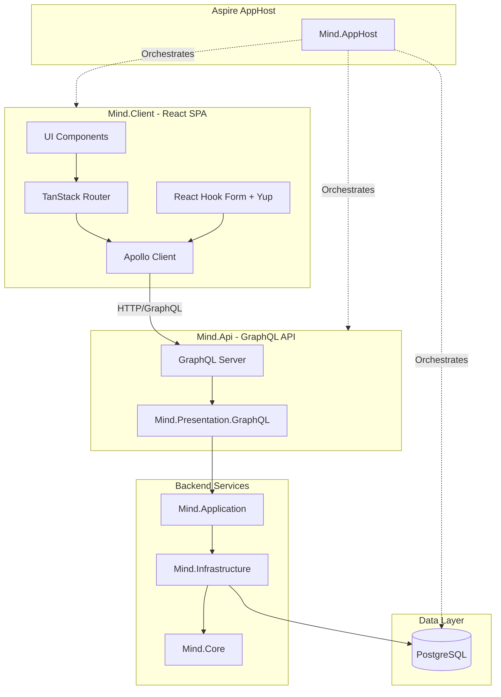
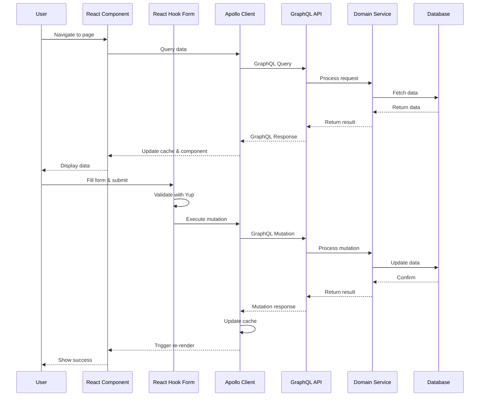
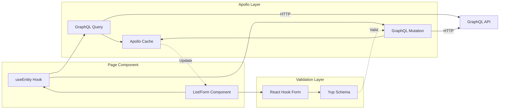
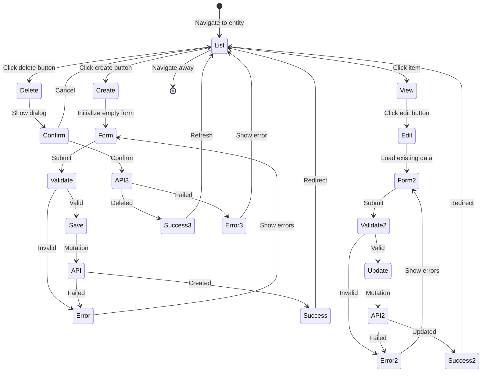
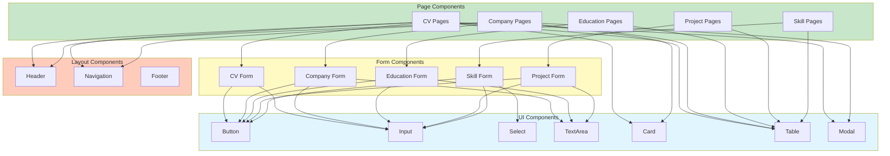
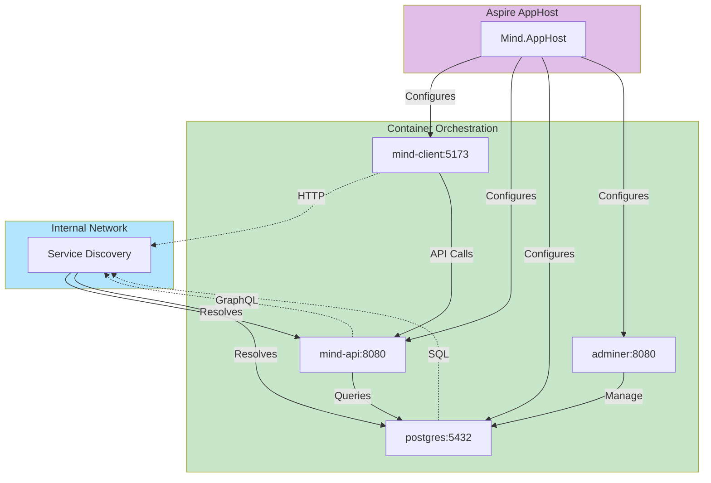

# Mind.Client Architecture Diagrams

## System Overview



## Application Flow



## Component Hierarchy

```mermaid
graph TD
    App[App.tsx]
    Root[__root.tsx - Layout]

    App --> Root

    Root --> Home[index.tsx - Home]
    Root --> CvList[cvs/index.tsx]
    Root --> CvCreate[cvs/create.tsx]
    Root --> CvEdit[cvs/$id.edit.tsx]

    Root --> CompanyList[companies/index.tsx]
    Root --> CompanyCreate[companies/create.tsx]
    Root --> CompanyEdit[companies/$id.edit.tsx]

    Root --> EducationList[education/index.tsx]
    Root --> EducationCreate[education/create.tsx]
    Root --> EducationEdit[education/$id.edit.tsx]

    Root --> ProjectList[projects/index.tsx]
    Root --> ProjectCreate[projects/create.tsx]
    Root --> ProjectEdit[projects/$id.edit.tsx]

    Root --> SkillList[skills/index.tsx]
    Root --> SkillCreate[skills/create.tsx]
    Root --> SkillEdit[skills/$id.edit.tsx]

    style App fill:#e1f5ff
    style Root fill:#bbdefb
    style Home fill:#90caf9
    style CvList fill:#fff9c4
    style CompanyList fill:#fff9c4
    style EducationList fill:#fff9c4
    style ProjectList fill:#fff9c4
    style SkillList fill:#fff9c4
```



## Data Flow Pattern



## Routing Structure

```mermaid
graph TD
    Root[/ - Root Layout]

    Root --> Index[/index - Home]

    Root --> Cvs[/cvs - CV List]
    Root --> CvCreate[/cvs/create - Create CV]
    Root --> CvEdit[/cvs/:id/edit - Edit CV]

    Root --> Companies[/companies - Company List]
    Root --> CompanyCreate[/companies/create - Create Company]
    Root --> CompanyEdit[/companies/:id/edit - Edit Company]

    Root --> Education[/education - Education List]
    Root --> EducationCreate[/education/create - Create Education]
    Root --> EducationEdit[/education/:id/edit - Edit Education]

    Root --> Projects[/projects - Project List]
    Root --> ProjectCreate[/projects/create - Create Project]
    Root --> ProjectEdit[/projects/:id/edit - Edit Project]

    Root --> Skills[/skills - Skill List]
    Root --> SkillCreate[/skills/create - Create Skill]
    Root --> SkillEdit[/skills/:id/edit - Edit Skill]

    style Root fill:#e1bee7
    style Index fill:#ce93d8
    style Cvs fill:#fff9c4
    style Companies fill:#c8e6c9
    style Education fill:#ffccbc
    style Projects fill:#b3e5fc
    style Skills fill:#f8bbd0
```

## CRUD Operation Pattern



## Component Reusability



## Deployment Architecture with Aspire


